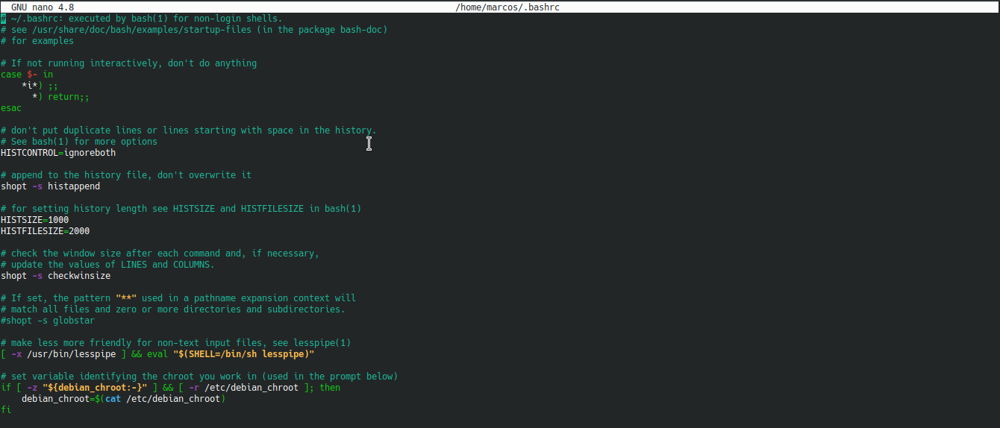

# Comandos

Tal y como hemos avanzado en la introducción, la forma más rápida y eficiente de interacturar con un sistema operativo GNU/Linux es a través de la terminal. En este apartado procederemos a explicar con más detalle que es la terminal, el intérprete de comandos y algunos comandos útiles para empezar a navegar por el sistema.

## ¿Qué es la terminal?

La Terminal de Linux es una consola, similar a CMD o PowerShell(pero mucho más avanzada que ambas), utilizada para permitir a los usuarios más avanzados y técnicos controlar hasta el más mínimo detalle del sistema operativo.

Desde esta consola podemos ejecutar todo tipo de binarios, aunque lo suyo es ejecutar aquellos que no tienen interfaz gráfica y que deben usarse mediante comandos. Igual que en otros sistemas operativos, podemos ejecutar cualquier binario o script directamente desde su directorio. Además, Linux tiene también un PATH donde podemos guardar binarios y ejecutarlos sin tener que desplazarnos hasta su directorio. Por defecto, el PATH de Linux está formado por los siguientes directorios (donde se busca el comando en orden):

- /usr/local/sbin
- /usr/local/bin
- /usr/sbin
- /usr/bin
- /sbin
- /bin
- /usr/games
- /usr/local/games
- /snap/bin

La terminal de Linux se basa en un lenguaje de scripting conocido como Bash, heredada de sh, la consola de Unix. Podemos ejecutar scripts desde la consola, ejecutar binarios y realizar todo tipo de tareas. A diferencia de Windows, Linux cuenta en su terminal una gran cantidad de herramientas muy avanzadas para administrar y controlar el sistema operativo.

Para abrir una terminal en la mayoría de las distribuciones de GNU/Linux debemos pulsar las teclas:

```cpp
ctrl + alt + t
```
O en su defecto buscarla en el menú de aplicaciones.

## ¿Qué es un intérprete de comandos?


GNU Bash o simplemente Bash (Bourne-again shell) es una popular interfaz de usuario de línea de comandos, específicamente un shell de Unix; así como un lenguaje de scripting. Bash fue originalmente escrito por Brian Fox para el sistema operativo GNU, y pretendía ser el reemplazo de software libre del shell Bourne.​ Lanzado por primera vez en 1989, se ha utilizado ampliamente como el intérprete de inicio de sesión (login) predeterminado para la mayoría de las distribuciones de GNU/Linux, y también de Mac OS X de Apple hasta la versión 10.15​. Una versión también está disponible para Windows 10 y Android.​ También es el intérprete de órdenes de usuario predeterminado en Solaris 11.

Bash es un intérprete de órdenes que generalmente se ejecuta en una ventana de texto donde el usuario escribe órdenes en modo texto. Bash también puede leer y ejecutar órdenes desde un archivo, llamado guion o 'script'. Al igual que todos los intérpretes de Unix, es compatible con el agrupamiento de nombres de archivo (coincidencia de comodines), tuberías, here documents, sustitución de comandos, variables y estructuras de control para pruebas de condición e iteración. Las palabras reservadas, la sintaxis, las variables de ámbito dinámico y otras características básicas del lenguaje se copian de sh. Otras características, por ejemplo, el historial, se copian de csh y ksh. Bash es un intérprete de órdenes compatible con POSIX, pero con varias extensiones.

## Algunos comandos básicos

|Comando|Descripción|
|-|-|
|man|Muestra el manual del comando que le indiquemos|
|help|Da una ayuda de los comandos|
|ls|Lista los archivos y directorios|
|cd|Cambia de directorio|
|pwd|Muestra la ruta al directorio actual|
|mkdir|Crea un directorio|
|rm|Borra archivos|
|mv|Mueve o renombra archivos y directorios|
|nano|Abre un editor de texto en la terminal|
|chmod|Cambia permisos de archivos y directorios|
|su|Cambia de usuario|
|whoami|Muestra el nombre de usuario actual|
|logname|Muestra el nombre de usuario|
|id|Muestra datos de identificación del usuario|
|finger|Da información de usuario|
|who|Muestra los usuarios actuales del sistema|
|chown|Cambia el propietario de un fichero|
|top|Muestra los procesos que se están ejecutando y permite matarlos|
|ps|Muestra la lista de procesos del usuario|
|ps aux	|Muestra la lista de procesos de la máquina|
|kill|Envía un evento concreto a un proceso|
|killall|Mata un proceso por su nombre|
|time|Mide el tiempo que tarda un proceso en ejecutarse|
|fg|Trae a primer plano un proceso parado o en segundo plano|
|bg|Pone un proceso en segundo plano|
|df|Muestra el espacio libre de los discos/dispositivos|
|ssh|Se conecta a otra máquina de forma remota (remote shell)|
|wget|Descarga archivos de internet|
|reboot|Reinicia la máquina|
|shutdown|Apaga el sistema|

## Crea tus propios comandos

Como ya hemos visto, ubuntu nos permite modificar y organizar todo para dejarlo a nuestro gusto, incluso los comandos de la propia terminal. Para ello debemos de modificar el archivo llamado bashrc al que accederemos por medio del siguiente comando:

    nano ~/.bashrc

Y se nos abrirá una ventana como esta:



Una vez aquí bajaremos hasta el final del archivo donde podremos añadir nuestros propios comandos escribiendo lo siguiente:

    alias <nombreDelComando>='<ordenQueEjecutara>'

Simplemente debemos de darle un nombre al comando y asignarle una orden. Un ejemplo para crear una carpeta seria

    alias hola='mkdir adios'

Una vez que hemos añadido nuestro alias, guardamos el fichero y ejecutamos el siguiente comando para poder utilizarlo sin necesidad de reiniciar la terminal

    source ~/.bashrc

Para eliminar un alias agregado a través de la línea de comandos, se puede utilizar el comando unalias.

    unalias nombre_del_alias

En caso de querer eliminar todas las definiciones de alias, podemos ejecutar el siguiente comando:

    unalias -a [elimina todos los alias]

## Ejercicios

Ahora vamos a realizar los siguientes ejercicios para afianzar los contenidos y empezar a acostumbrarnos a la terminal

### Ejercicio 1

Descarga el siguiente script, ejecutalo y averigua lo que ha hecho. Si ha creado algún directorio borralo.

<a id="raw-url" href="https://raw.githubusercontent.com/github-username/project/master/filename">Download FILE</a>

### Ejercicio 2

### Ejercicio 3
