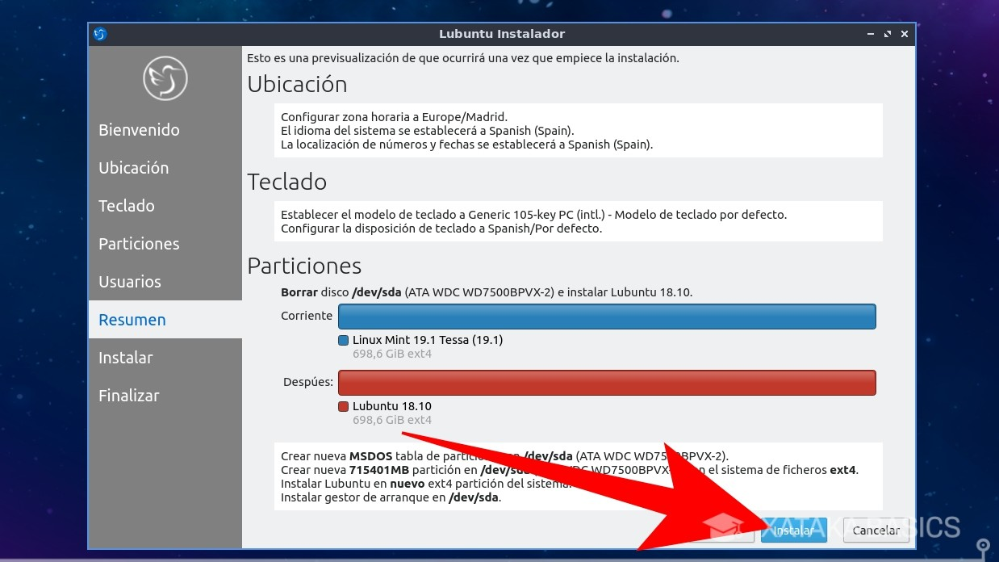

# Instalación

En este apartado vamos a repasar los pasos a seguir a la hora de instalar una distribución GNU/Linux

## Primero tienes que elegir una distribución

Tal y como hemos visto en el apartado anterior existen multitud de distribuciones entre las que podemos elegir. Lo mejor es probarlas todas y quedarte con la que mas te guste y mejor se adapte a ti.

En este tutorial vamos a instalar Lubuntu(Una distribución para equipos con pocos recursos). Pero si tu equipo es reciente te recomendamos descargar ubuntu para ello visita el siguiente enlace:

[https://ubuntu.com/download/desktop/thank-you?version=21.04&architecture=amd64](https://ubuntu.com/download/desktop/thank-you?version=21.04&architecture=amd64)

## Crea el USB de instalación

Una vez ya tienes la imagen ISO, te queda descargar la aplicación con la que crear el USB de arranque. Tienes muchas entre las que puedes elegir, aunque nosotros hemos optado por Rufus por llevar tiempo siendo la gran referencia en este campo. Para iremos a su página de descarga desde el siguiente enlace:

[https://rufus.ie/es/](https://rufus.ie/es/)

Y descargaremos la versión que corresponda para nuestro sistema operativo.

Una vez se haya descargado, haz doble click sobre la aplicación de Rufus. No necesitarás instalar nada, ya que se iniciará automáticamente. Ahora, conecta al ordenador el USB que quieras utilizar, y comprueba que el USB aparece en el campo Dispositivo (1) que tienes arriba del todo. Ahora pulsa sobre la opción Seleccionar (2) para elegir la imagen ISO con la que quieres crear el USB de arranque.

Cuando pulses en Seleccionar, se abrirá un explorador de archivos. En él tienes que buscar y seleccionar el archivo .ISO de la distro que hayas descargado, y pulsar el botón Abrir para que quede seleccionado en Rufus.

Una vez hayas seleccionado el archivo ISO, el resto de opciones por defecto son las correctas para prácticamente cualquier caso u ordenador. Por lo tanto, a no ser que tengas unos conocimientos avanzados y quieras cambiar algo por las especificaciones concretas de tu ordenador, con dejarlo todo como está y pulsar el botón Empezar ya es suficiente para crear tu USB.

Cuando pulses en Empezar, Rufus te lanzará un aviso diciéndote que la versión del gestor de arranque syslinux que utiliza es más antigua que la que solicita la ISO. Por lo que debes pulsar el botón Sí para que Rufus se conecte a Internet y descargue automáticamente la versión que necesita.

Tras ese trámite, te aparecerá otra ventana en la que se informa de que la ISO que has descargado puede ser escrita de dos maneras en tu USB. Aquí, lo recomendable es que dejes seleccionada la opción Escribir en modo Imagen ISO y pulsas el botón OK.

Y por último, Rufus te advertirá de que al realizar este proceso perderás todos los datos que tengas en el USB que vayas a utilizar. Si estás conforme, pulsa en el botón Aceptar y se empezará a preparar el USB de arranque. Espera a que termine, y una vez se complete el proceso ya podrás sacar el USB y arrancar con él el nuevo ordenador.

## Reinicia el equipo y sigue los pasos del asistente de instalación

Una vez tienes preparado el USB, tienes que arrancar el ordenador desde el. Para ello, mete el USB en una ranura y luego enciende el ordenador pulsando inmediatamente la tecla que ejecute el selector de unidad para el arranque. Por lo general esta debería ser F12, pero dependiendo de la BIOS y el PC pueden ser otras como F1, F8, F9, F10, TAB o ESC. Cuando veas el menú, selecciona la unidad del USB de arranque y pulsa Enter para arrancar el ordenador a través de él.

Cuando arranques el USB, la primera pantalla que te va a aparecer es la de elegir idioma. En ella, simplemente selecciona el idioma que quieras utilizar haciendo click sobre él con el ratón o, si no tienes, seleccionándolo y pulsando Enter.

Una vez elegido el idioma, entrarás en la pantalla principal del USB de Lubuntu. En ella vas a poder iniciar la distro desde el propio USB, comprobar errores o la memoria, o volver a tu sistema operativo convencional arrancando el ordenador desde el disco duro. En esta pantalla, pulsa en la opción Start Lubuntu para arrancar la distribución.

Se iniciará el sistema operativo a través del USB, por lo que sin necesitar instalarlo podrás explorarlo un poco para ver si te gusta o prefieres probar con otro. Si te convence y quieres seguir adelante, ejecuta la aplicación de instalación que debes tener en el escritorio. Independientemente de la distro que hayas elegido, en la mayoría de ellas encontrarás una de estas aplicaciones.

El proceso de instalación puede variar dependiendo de la distribución, aunque muchas de ellas comparten las mismas líneas generales. En cualquier caso, nosotros nos vamos a ceñir al proceso de Lubuntu, que es el mismo que verás en muchas distribuciones basadas en Debian y Ubuntu. En él, la primera pantalla es de introducción, y sólo tendrás que elegir el idioma y pulsar en Siguiente. En algunos casos te pedirán conectarte a la WiFi, pero Lubuntu no lo pide.

En el siguiente paso vas a tener que escoger la región y la zona en la que vives. Por ejemplo, yo he elegido Europa y Madrid, pero dependiendo de la parte del mundo donde vivas puedes adaptarla a tus necesidades. También puedes elegir el idioma del sistema y las fechas. Cuando lo tengas todo, pulsa en Siguiente para continuar.

Ahora le llega el turno a la distribución del teclado. En este apartado, debes elegir cuál es la distribución de las teclas que tiene el teclado físico de tu ordenador o portátil para que Lubuntu las configure de manera que la v esté donde la v y la ñ donde la ñ. Por ejemplo, si tienes un teclado sin la letra ñ tendrás que buscar la distribución concreta que utilice en vez de la española... o poner la española para utilizar la ñ aunque no la tenga el teclado. Al terminar pulsa Siguiente.

La siguiente es la parte más importante de todo el proceso, y es la de decidir cómo quieres hacer la instalación. En el día de hoy vamos a hablar sobre cómo revivir un ordenador, por lo que al haber elegido una distro tan ligera no tendría sentido instalarla junto a otras más modernas que requieran más hardware. Por lo tanto, vamos a seleccionar la opción de Borrar disco y pulsar en Siguiente.

Con esta opción, se formateará el disco duro para que quede instalado únicamente Lubuntu o la distro que hayas elegido. En un próximo artículo te diremos cómo instalar GNU/Linux junto a Windows, y entonces ya recurriremos a una de las demás opciones para manipular las particiones del disco y hacer sitio a mano para el nuevo sistema junto a Windows.

Pero en este caso, lo borraremos todo e instalaremos por encima, que también es el método más sencillo para iniciarse con un ordenador que no utilices para nada más. Así sabes que si fastidias algo sin querer, esto no va a repercutir en Windows.

Una vez has seleccionado cómo vas a instalar el sistema operativo, ya va siendo hora de terminar. Pero antes, tienes que elegir un nombre de usuario y contraseña para crear tu primer usuario. A este, también le puedes poner tu nombre real, y puedes elegir otro nombre para el ordenador. La contraseña es obligatoria, pero tras ponerla puedes marcar la casilla de Conectarse automáticamente sin pedir la contraseña para que no tengas necesidad de utilizarla. Cuando lo hagas, pulsa Siguiente.

Y para terminar llegarás a un resumen con todo lo que has elegido. Aquí tendrás que comprobar que todo está a tu gusto, como por ejemplo el que se reemplacen todas las particiones que tuvieras antes por una única. En este punto, ten en cuenta que yo he hecho esto en un ordenador de pruebas donde tenía Linux Mint, o sea que es posible que en tu pantalla aparezca diferente. Si todo está en orden, pulsa en el botón Instalar que tienes en azul para proceder.

Antes de proceder, el sistema de instalación de avisará de que estás a punto de hacer cambios irreversibles en el disco duro borrando todo lo que tengas para instalar la distro. Es tu última oportunidad de echarte para atrás, pero si estás seguro de que quieres continuar pulsa en el botón Instalar ahora para proceder.

Y ya está. 

## Otras opciones

Si no quieres instalarlo en tu equipo siempre puedes hacer uso de una máquina virtual para ello te recomendamos seguir los pasos del siguiente tutorial:

[https://www.uco.es/aulasoftwarelibre/wp-content/uploads/2020/11/Como-instalar-Ubuntu-en-una-maquina-virtual.pdf](https://www.uco.es/aulasoftwarelibre/wp-content/uploads/2020/11/Como-instalar-Ubuntu-en-una-maquina-virtual.pdf)