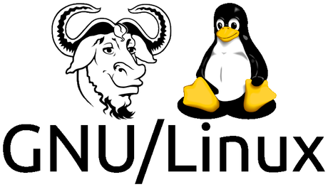

# Introducción

## ¿Qué es Linux?

GNU/Linux es el nombre que reciben los sistemas operativos basados en Unix. Al igual que Windows o MacOS, es el software necesario para que el hardware de un ordenador funcione correctamente. Además, los sistemas GNU/Linux suelen ser de código abierto, multiplataforma, multiusuario y multitarea. Estos sistemas operativos están formados mediante la combinación de varios proyectos, entre los cuales destaca el entorno GNU, encabezado por el programador estadounidense Richard Stallman junto a la Free Software Foundation, una fundación cuyo propósito es difundir el software libre, así como también el núcleo de sistema operativo conocido como «Linux», encabezado por el programador finlandés Linus Torvalds.

El desarrollo de estos sistemas operativos es uno de los ejemplos más prominentes de software libre: todo su código fuente puede ser utilizado, modificado y redistribuido libremente por cualquier persona, empresa o institución, bajo los términos de la Licencia Pública General de GNU, así como de otra serie de licencias.​ La idea de desarrollar un sistema operativo libre y basado en el sistema operativo Unix, se remonta a mediados de la década de 1980 con el proyecto GNU.

Unix es un sistema operativo desarrollado en 1969 en los laboratorios Bell de AT&T. Uno de los colaboradores del proyecto fue Dennis Ritchie, también desarrollador del famoso lenguaje de programación C.

GNU es un sistema operativo de tipo Unix, además de una colección de programas (compiladores, intérpretes de comandos, etc) para el proyecto GNU creado por Richard Stallman (1983). El nombre de GNU es un acrónimo de "GNU's Not Unix", ya que GNU se diferencia de Unix por ser software libre, además de no contener código de Unix (sólo su tipo de diseño).

Por un lado tenemos los programas y herramientas desarrollados por el proyecto GNU. Por otro, en 1991 Linus Torvalds, por aquel entonces estudiante en la universidad, estaba utilizando el sistema operativo MINIX, que consistía en un clon de Unix dirigido a la enseñanza. Torvalds decidió crear su propio núcleo. Es entonces cuando desarrolla Linux. Linux es el Kernel o Núcleo del sistema operativo GNU/Linux, es decir, el software encargado de gestionar los recursos del sistema.

   Kernel Linux + Herramientas GNU = GNU/Linux

Sin embargo, tras publicar Torvalds su núcleo Linux en 1991 y ser este usado junto al software del proyecto GNU, una parte significativa de los medios generales y especializados han utilizado el término «Linux» para referirse a estos sistemas operativos completos.​ Cabe señalar que, existen derivados de sistemas operativos que usan el núcleo Linux, pero que no tienen componentes GNU, como por ejemplo el sistema operativo Android.

                              
El concepto de Software Libre caracteriza tanto a GNU/Linux como al proyecto GNU.
El software libre es un software cuyo código fuente puede ser estudiado, modificado y utilizado libremente con cualquier finalidad. Así como ser redistribuido. Lo opuesto sería el software privativo.

Para que un software se considere libre, debe cumplir las "cuatro libertades":

1. Libertad de uso.
2. Libertad de estudio.
3. Libertad de modificación.
4. Libertad de distribución. 

Algunos ejemplos de software libre son Firefox, Open Office, Moodle, OBS
Ahora bien, si bien es verdad que gran parte del software libre es gratuito, no todos lo son. De hecho se puede cobrar por un programa de software libre.
Realmente, el software libre es un movimiento social, que lucha por poder utilizar, compartir y estudiar el software libremente.
La Free Software Foundation defiende que el software es conocimiento y que debería ser accesible a todo el mundo.
La mayoría de proyectos de software libre son mantenidos por la propia comunidad de usuarios y desarrolladores.

## ¿Por qué debemos usar Linux?

### Siempre actualizado

Su condición de sistema operativo de código abierto hace posible aprovechar los permanentes avances en software, con programas desarrollados por informáticos en todo el mundo que amplían en forma constante su rango de acción.

### Está centrado en el aprovechamiento de las redes

Linux posee un fuerte soporte para el área de comunicaciones y redes.
Orientado al trabajo en red, Linux es una inmensa alianza de usuarios distribuidos en todo el planeta, que aportan mejoras y soluciones  en forma abierta mediante Internet. Gracias a esta condición, Linux se desarrolla más rápidamente y en forma más eficiente. Además, el sistema operativo posee un fuerte soporte para el área de comunicaciones y redes.

### Es un sistema operativo hecho a medida

La posibilidad de modificaciones constantes y libres y su gran poder de cómputo y procesamiento han transformado a Linux en el sistema operativo preferido por los informáticos y especialistas.

### Brinda soporte a todo tipo de hardware y puede funcionar en múltiples plataformas

La ductilidad de Linux en cuanto a su uso en diferentes clases de plataformas y dispositivos, como así también su capacidad para facilitar la operatoria de toda clase de hardware son condiciones que destacan especialmente en este sistema operativo.

### Permite personalizar la interfaz de usuario

Los usuarios de Linux pueden adaptar el entorno operativo a sus necesidades.
Un punto vital de Linux es que cada usuario tiene la posibilidad de personalizar su interfaz, también denominada Shell. De esta manera, los usuarios del sistema pueden adaptar el entorno operativo a sus propias necesidades y requerimientos.

### Presenta una importante capacidad multitarea

Esta característica hace posible que en Linux se ejecuten múltiples programas al mismo tiempo y con buen rendimiento sin necesidad de detener alguna de las aplicaciones. Lógicamente, esto multiplica la capacidad funcional concreta.  .

### Favorece el trabajo en modo multiusuario

Múltiples usuarios pueden acceder a los recursos y las aplicaciones que brinda Linux al mismo tiempo, distribuyendo los mencionados recursos con solvencia operativa y en un marco de excelentes condiciones de seguridad informática.

### Garantiza un avanzado nivel de seguridad

Linux es el sistema operativo líder en cuanto a seguridad. 
El empleo del algoritmo DES, con testeos que comprueban su seguridad, como así también el aporte constante de los usuarios en cuanto a avances y modificaciones han convertido a Linux en un sistema operativo líder en cuanto a seguridad. Un ejemplo claro es que la NASA lo ha elegido para la operatoria informática de muchas de sus misiones.

### Permite un mayor control de los dispositivos

A diferencia de otros sistemas operativos, Linux nos ofrece la posibilidad de contar con los controladores de cada dispositivo, como así también instalar nuevos controladores ante la incorporación de nuevos elementos. Gracias a esta característica, dispondremos de mayor independencia y capacidad de maniobra en el control de cada dispositivo.

## Principales distribuciones

Estas son todas las distribuciones de linux disponibles desde 1992 hasta 2013. En la actualidad el desarrollo ha continuado y han surgido un montón de distribuciones nuevas que se han ido uniendo a las ya existentes.

### Ubuntu

Esta distro está basada en Debian y es la más usada en el mundo. Así que seguramente la usas o has escuchado de ella. Ubuntu proviene de las lenguas Zulú y Xhosa y significa humanidad para otros. Nace con el objetivo de llevar Linux a todo el mundo, ya que anteriormente Linux era un sistema operativo difícil de manejar y requería conocimientos técnicos. Es muy usada en escritorio y servidores.

### Debian

Es una de las distribuciones más confiables. La mayoría de las distribuciones Linux son derivadas de Debian, ¿por qué? Porque es una de las más antiguas y es muy estable. Si creas una distribución basada en Debian podrás contar con todas las actualizaciones de seguridad, rendimiento y compatibilidad que trae el sistema.

### Arch Linux

Esta distribución Linux no tiene interfaz gráfica, por lo que debes configurar las herramientas que en otras distros ya vienen por defecto. Aquí nos preguntamos, ¿quién quiere usar un sistema operativo así de limpio? La respuesta es: usuarios avanzados que tienen un perfil más técnico y quieren probar configuraciones y construir sus propios escenarios.

### RedHat

Si creías que por ser open source no genera dinero, estás equivocado. Apenas en el 2019 Red Hat facturó más 3 mil millones de dólares con servicios basados en Linux. Si quieres usar la versión para empresas: Red Hat Enterprise Linux, debes pagar por ella. Entre sus servicios brinda soluciones personalizadas a través de un gran soporte. Es por esto que es la distro más importante para el entorno corporativo.

### CentOs

Está basada en Red Hat, es gratuita y está destinada a la comunidad. Se hizo popular en los servidores porque brindaba la estabilidad y confiabilidad de Red Hat, pero sin tener que pagar.

### Fedora

Es una distro basada en Red Hat para el usuario final. Usa el mismo manejador de paquetes y es gratuita. Si bien Fedora está desarrollada por una comunidad libre, Red Hat auspicia esta distro y contribuye a las mejoras del kernel.

### Lubuntu

Lubuntu es una distribución GNU/Linux ligera, basada en Ubuntu, que emplea el entorno de escritorio LXQt en lugar del entorno GNOME de Ubuntu. Los requerimientos de hardware de Lubuntu/LXDE solían ser similares a los de Windows XP: un procesador Pentium II o III entre 400-500 MHz. En sus versiones más recientes los requerimientos del sistema son: 1 GB de RAM (512 MB como mínimo) y un procesador Pentium 4 o Pentium M o un procesador AMD K8. Esta es la versión que se encuentra instalada en los equipos y en la que profundizaremos en los siguientes puntos.

## Conceptos básicos

Algunos conceptos básicos que debemos conocer si queremos profundizar un poco más en como funciona este sistema operativo son:

- En linux TODO son ficheros.
- Un repositorio es un espacio centralizado donde se almacena, se mantiene y se difunde información digital, normalmente software.
- Un gestor de paquetes es una colección de repositorios y herramientas que sirven para automatizar la instalación, actualización y eliminación de software.
- Es multiusuario, multitarea y multiplataforma
- La forma más rápida de interactuar con el sistema es a través de la terminal
- Su kernel es modular
- Puedes tocarlo TODO (por eso ten cuidado con lo que tocas y no lo rompas)

## Permisos

Hay 3 atributos básicos para archivos simples: lectura, escritura y ejecutar.

 
### Permiso de lectura (read)
Si tienes permiso de lectura de un archivo, puedes ver su contenido.

### Permiso de escritura (write)
Si tienes permiso de escritura de un archivo, puedes modificar el archivo. Puedes agregar, sobrescribir o borrar su contenido.

### Permiso de ejecución (execute)

Si el archivo tiene permiso de ejecución, entonces puedes decirle al sistema operativo que lo ejecute como si fuera un programa. Si es un programa llamado «foo» lo podremos ejecutar como cualquier comando.
O un script (interprete) que necesita permiso de lectura y ejecución, un programa compilado solo necesita ser lectura.

### Caracteres atribuidos a los permisos son:

- r quiere decir escritura y viene de Read
- w quiere decir lectura y viene de Write
- x quiere decir ejecución y viene de eXecute

### ¿A quien se aplican estos permisos?

- Usuario (u) proviene de user
- Grupo (g) proviene de group
- Otros (o) proviene de other

Y se distribuyen de la siguiente forma:

### Usando chmod para cambiar los permisos

chmod (change mode) es el comando utilizado para cambiar permisos, se pueden agregar o remover permisos a uno o mas archivos con + (mas) o – (menos)

