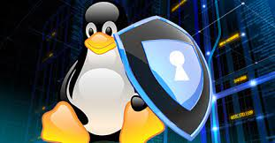

# Seguridad

    

## ¿Es Seguro GNU/Linux?

La seguridad, en GNU/Linux, como ocurre con Windows o macOS, no la da un solo sistema, ni aplicación, al igual que tampoco la da un solo administrador o usuario. Por contra, es un concepto multifactorial, y que depende de muchos factores sumados entre si y actuando en sinergia.

Tradicionalmente, ha habido siempre bastante debate entorno a si hay o no hay virus en Linux, y en la necesidad o no de utilizar antivirus u otras soluciones de seguridad. Lo cierto es que, más allá de estas discusiones, creo que hay que ver el tema de la seguridad con un enfoque más global.

Sería un error valorar la seguridad basándose solo en el nivel de virus que haya sobre una determinada plataforma, o en la cantidad de determinados ataques que pueda recibir. De esto dependen muchos otros factores que van más allá de la arquitectura del propio sistema, como la cuota de mercado, o el interés que haya en atacar una determinada plataforma por parte de cibercriminales y creadores de malware.

Con esto en mente, es realmente difícil determinar cuanto de seguro es Linux con respecto a otros sistemas operativos como Windows o macOS. Esto, por no hablar que no hay dos instalaciones de Linux iguales, ni tampoco de Windows. La seguridad no solo la da el sistema en si, sino también:

- Lo actualizado que esté y la frecuencia en que se actualice.
- Las aplicaciones que tenga (posibles puertas a nuevas vulnerabilidades).
- Lo bien o mal configurado que esté.
- El usuario que lo administra y/o lo utiliza.
- Lo expuesto que esté a posibles ataques (esto depende de lo critica que sea la función que cumpla).

Esto, por no decir que GNU/Linux cuenta con un enorme universo de distribuciones, cada una de los cuales tiene sus propios criterios en cuanto a la mejor manera de definir la seguridad de base de su criatura.

Hay distribuciones que llevan el cortafuegos habilitado por defecto, otros no. Las hay que cuentan con con potentes frameworks de seguridad como AppArmor o SELinux, mientras otras vienen más peladas. Y ni tan siquiera algo tan básico como el Kernel, no tiene por que venir configurado igual en todas ellas.

### Recomendaciones Básicas de Uso

A continuación, te doy algunas recomendaciones de lo que creo que debes tomar en consideración como punto de partida, utilices la distribución que utilices.

1. Compartimentar actividades. Esta es una medida de uso general y de carácter universal (no aplica solamente a Linux). Sin embargo, me parece crucial. Se trata simplemente de no usar un único sistema para todo. Si no quieres liarte en exceso con esto, puedes empezar con lo más básico, que seria separar entre lo personal, lo profesional, y otras actividades concretas como operar con la banca online (para lo cual puedes utilizar un LiveCD o LiveUSB, o bien instalar Linux directamente en una memoria USB, y utilizarla como sistema adicional al conectarla a tu PC principal y arrancar con ella).

2. Elegir una distribución (o distribuciones) con una numerosa comunidad detrás. Esto no es una regla exacta, pero, en general, cuanto más grande sea la comunidad de usuarios y desarrolladores con que cuente el proyecto, más garantizada esta la supervivencia y continuidad del proyecto a largo plazo, y más ojos atentos habrá para detectar cualquier error de seguridad y poder ofrecer el parche apropiado al usuario.

3. Mantener el sistema siempre actualizado. Cualquier software tiene vulnerabilidades que antes o después se acaban descubriendo. Por muchas barreras de protección que utilices, siempre estarás expuesto a que tu sistema pueda verse comprometido por la explotación de una de esas vulnerabilidades. Por este motivo, la mejor garantía para mantenerte protegido frente a ello es asegurarse que todo el software esté correctamente parcheado.

4. Instalar software solo desde fuentes oficiales y de confianza. Una de las principales diferencias que tenemos en gran parte de las distribuciones GNU/Linux, con respecto a Windows, es la existencia de los repositorios de software, desde donde puedes optar a instalar todas las aplicaciones que necesites, con bastantes garantías de que todos los paquetes ofrecidos han sido validados por los empaquetadores de la distribución..
Anuncios

A partir de ahí, utilices el sistema que utilices, siempre hay determinadas medidas de protección que puedes tomar. A continuación lo veremos.

### Medidas de Protección

Muchas de las distribuciones ya vienen configurados con un nivel de seguridad bastante aceptable, por lo que quedaría en tu mano el mismo sentido común exigible en el uso de cualquier plataforma. Aún así, siempre hay puntos que puedes mejorar, y que pueden acabar marcando una gran diferencia en determinados casos. A continuación de detallo algunas de las medidas que considero más importantes, tanto a nivel de configuración del propio sistema, como a nivel de uso.

1. Habilitar el cifrado completo de disco. Esto es algo que considero básico, sobretodo hablando de portátiles. La mayoría de distribuciones te permiten, en el mismo proceso de instalación, habilitar el cifrado de disco completo LUKS, junto con el sistema de volúmenes LVM. Otra alternativa es cifrar únicamente tu directorio personal mediante eCryptfs, algo que también siguen ofreciendo muchas distribuciones en el proceso de instalación, si bien se considera obsoleto desde 2016. En este sentido, a mi personalmente me gusta más la opción de LUKS.
2. Habilitar y configurar el cortafuegos del kernel. Esto es importante que lo compruebes, sobretodo en distribuciones como Ubuntu o Debian, que lo llevan deshabilitado por defecto. En estos casos, a parte de configurar tu mismo iptables, puedes mirar opciones más simples como UFW o Arno Iptables Firewall. Otras distribuciones, como Fedora o CentOS, ya disponen de firewalld, una herramienta de administración de iptables, que ya viene pre-configurada por defecto, y que dispone igualmente de una completa interfaz gráfica.
3. Configurar correctamente tus navegadores web. Aunque es aplicable a todas tus aplicaciones, en el caso del navegador web es especialmente importante, puesto que generalmente suele ser la principal puerta de entrada a Internet, y desde donde pueden venir gran parte de las amenazas. Aquí podemos jugar con el balance entre Chromium y Firefox. El primero destaca por su elevado nivel de seguridad, sobretodo gracias a las múltiples capas de sandbox, entre otras muchas cosas, mientras que el segundo saca pecho en cuanto a la privacidad, y a las incontables posibilidades de configuración que ofrece en ese sentido.
4. Utilizar un gestor de contraseñas. Gran parte de nuestra identidad se expresa y se materializa en un plano digital, y no es raro que lleguemos a acumular un número incontable de credenciales de acceso a diferentes plataformas. Aunque cada vez proliferan más los métodos de autenticación biométricos, aún seguimos dependiendo de las contraseñas en gran medida, por lo que utilizar un buen gestor de contraseñas es clave para mantener un poco de orden. En este sentido, mi preferido es KeePassXC, aunque posiblemente tu distribución ya incorpore de serie alguna utilidad parecida, integrada en el entorno de escritorio, como Seahorse en el caso de GNOME, o KDE Wallet en KDE Plasma.
5. Utilizar GnuPG para compartir ficheros cifrados. GnuPG es una herramienta de cifrado y firmas digitales incluido en la mayoría de distribuciones. Utiliza un mecanismo de claves publica/privada para compartir ficheros con otros usuarios, y se puede integrar con herramientas de correo como Mozilla Thunderbird. En GNOME, puedes utilizar Seahorse como herramienta gráfica para gestionar tus pares de claves GPG.
6. Instalar un antivirus como ClamAV. Esta es una medida que, por ahora, no considero tan imprescindible como las otras que he comentado. Sin embargo, utilizar un antivirus como ClamAV puede servirte, sobretodo, para escanear dispositivos USB u otras particiones.
7. Instalar una herramienta para la detección de Rootkits. Además de ClamAV, tienes otras herramientas contra amenazas más especificas, como son Chkrootkit y Rkhunter, centradas en la detección de rootkits, procesos ocultos o cambios en ficheros importantes del sistema.
8. Utilizar una herramienta de auditoria como Lynis. Lynis es una herramienta que realiza una auditoria general de tu sistema, en busca de problemas de seguridad en determinadas configuraciones, y te ofrece un indice general de protección, junto con una serie de recomendaciones que puedes seguir.

La lista de medidas de seguridad que puedes adoptar es realmente interminable, pero debes valora realmente cual es tu contexto, y cuales son tus necesidades reales de seguridad (lo que diríamos valorar coste/beneficio).