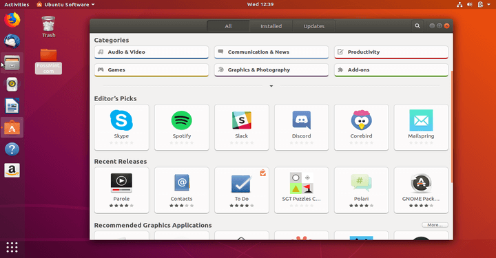

# Software

## ¿Cómo instalar software en Linux?
En Linux tenemos varias formas de instalar, eliminar o actualizar programas.


## Centro de software Ubuntu
   
   
Utilizar el centro de software de Ubuntu es la forma más sencilla en Ubuntu para gestionar aplicaciones. Sin embargo también es la más limitada, ya que no da opcion a elegir la versión del programa que queremos instalar. Digamos que sería el equivalente a la Play Store de Google o la Apple Store.

Para instalar un programa con Ubuntu software podemos usar el buscador, o guiarnos por las diferentes categorías que nos aparecen. Una vez seleccionada la aplicación, basta con presionar en "Instalar". De la misma manera, podemos desinstalar un programa con un solo click.


## Utilizando la herramienta APT
Como hemos visto, aunque podemos instalar aplicaciones de forma gráfica, siempre podemos recurrir a la terminal.ç
Pese a que en un principio esta opción puede parecer más complicada, cuando te acostumbras resulta incluso más cómodo.

### Los comandos de uso de APT en un terminal son los siguientes:
- Instalar paquetes:
```cpp
$ sudo apt-get install
```

- Desinstalar paquetes:
```cpp
$ sudo apt-get remove
```

- Desinstalar paquetes (incluyendo archivos de configuración):
```cpp
$ sudo apt-get purge
```

- Actualizar la lista de paquetes disponibles:
```cpp
$ sudo apt-get update
```
- Actualizar el sistema con las actualizaciones de paquetes disponibles:
```cpp
$ sudo apt-get upgrade
```


## Mediante paquetes
Otra forma de instalar aplicaciones en el sistema es por medio de los paquetes ya preparados para ser instalados y con extensión .deb.

Podemos hacer click directamente en el archivo .deb y lo podremos instalar con el centro de software de Ubuntu.
Otra manera es utilizar el comando dpkg:
```cpp
$ sudo dpkg -i file.deb
```
Para desinstalar un paquete usamos:
```cpp
$ sudo dpkg -r package_name
```

### Convertir paquetes .rpm a .deb

Algunas distribuciones de GNU/Linux, como por ejemplo Red Hat usan paquetes .rpm, organizados de manera diferente a los paquetes .deb de Debian y Ubuntu.

Para instalar estos paquetes debemos convertirlos antes al formato .deb. Para ello iusamos la aplicación alien:

En caso de no tenerla instalada, la instalamos:
```cpp
$ sudo apt-get update
$ sudo apt-get install alien
```
Convertimos el paquete con alien:

```cpp
sudo alien file.rpm
```
Y se generaría el .deb
